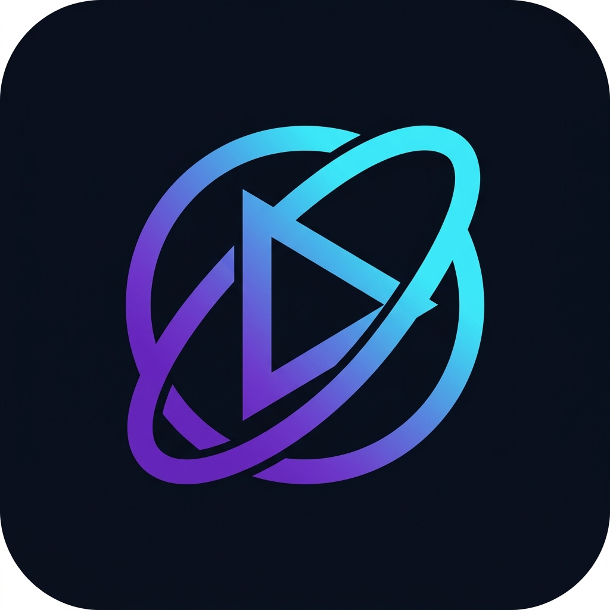
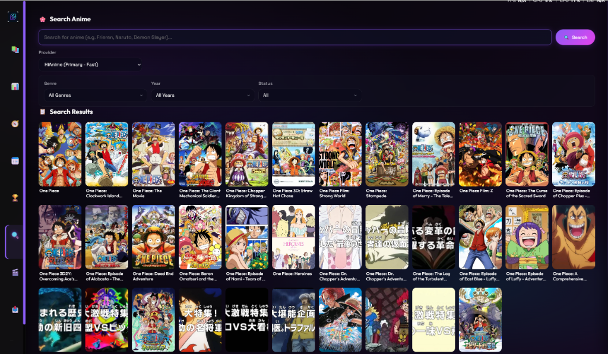
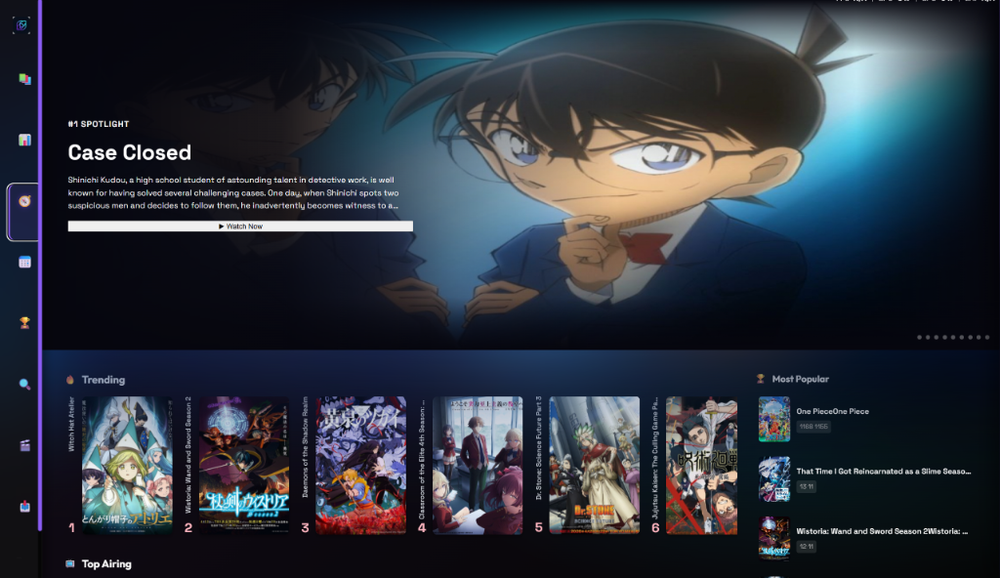
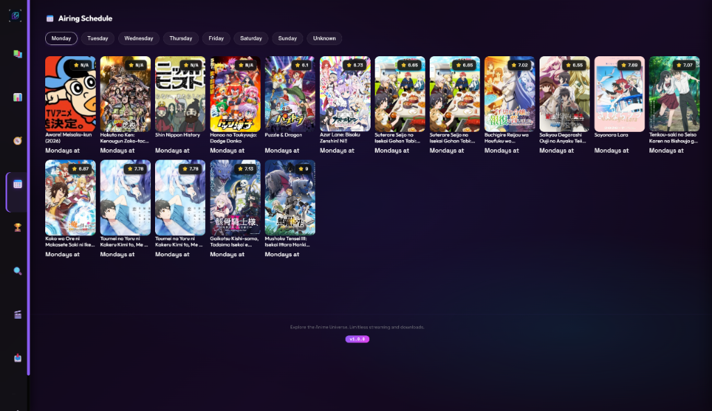
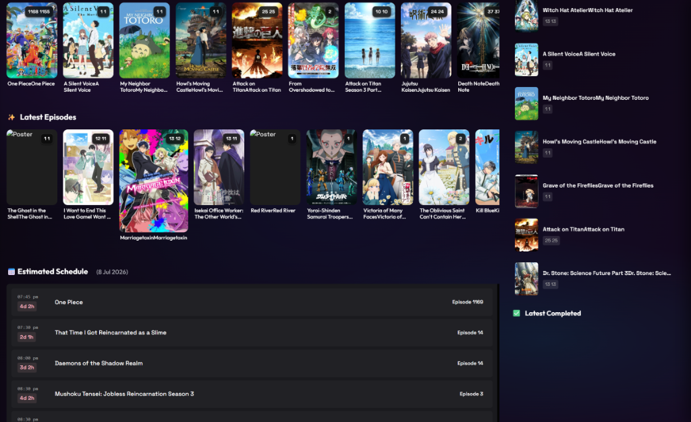
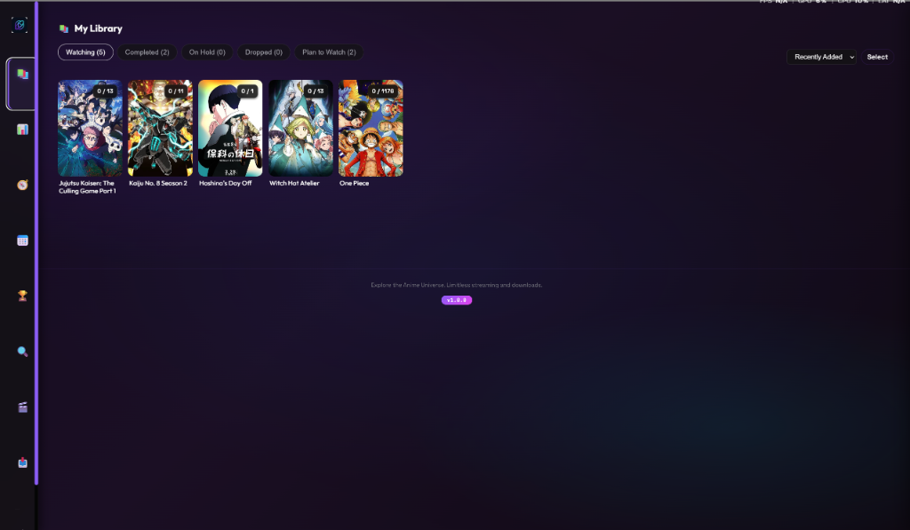
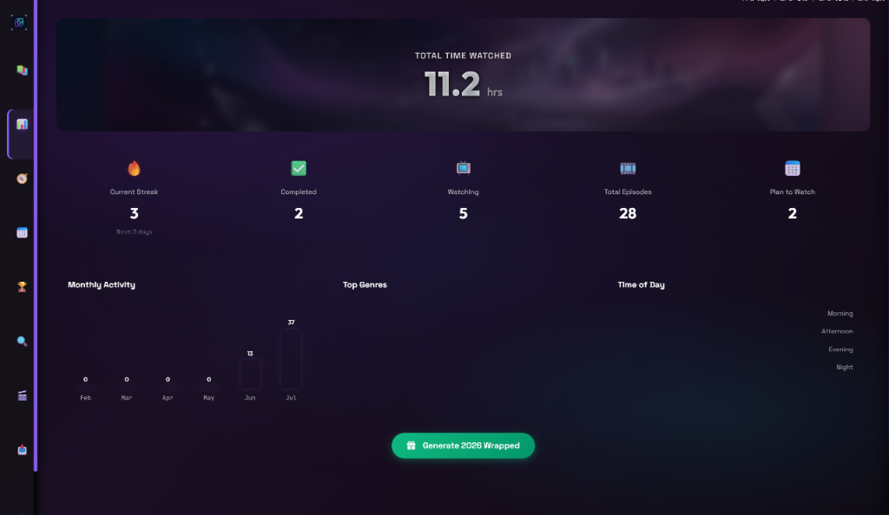
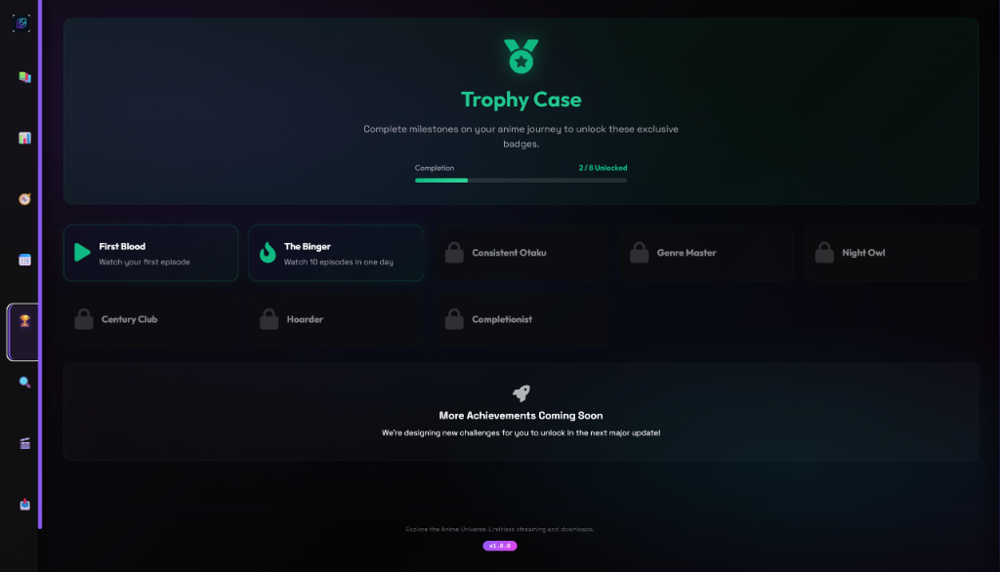
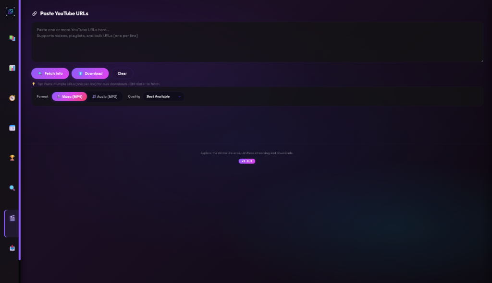

<p align="center">
  
</p>

<h1 align="center">NovaStream</h1>

<p align="center">
  <strong>🎬 Your anime, your library, your rules — no account, no cloud, no ads.</strong>
</p>

<p align="center">
  <a href="#-why-novastream">Why NovaStream</a> •
  <a href="#-features">Features</a> •
  <a href="#-installation">Installation</a> •
  <a href="#-development">Development</a> •
  <a href="#-screenshots">Screenshots</a> •
  <a href="#-license">License</a>
</p>

<p align="center">
  <a href="https://discord.gg/jAPG7cQcrC">
    
  </a>
</p>

---

## 🌟 Why NovaStream

Most anime trackers just track. Most players just play. NovaStream is built to be the one app that actually understands *how* you watch — not just what you've seen.

It knows if you're a Night Owl or a Binger. It builds you a **Radio** station out of your own library's openings and endings. It gives you a real-time-upscaled, MPV-powered player instead of a browser `<video>` tag. And at the end of the year, it hands you a fullscreen, animated **Wrapped** — your own anime year, summarized like nothing else in this space does.

Everything lives in a local SQLite file on your machine. No account required. No cloud dependency. Your data is yours.

## ✨ Features

### 🎬 Video & Streaming Engine
- **MPV-Powered Playback** — hardware-accelerated, far beyond a browser video tag
- **Real-Time Anime4K Upscaling** — press `Ctrl+1` through `Ctrl+6` mid-episode to switch upscale modes on the fly, `Ctrl+0` to disable
- **Auto-Play & Resume** — seamless next-episode transitions, exact-timestamp resume

### 🎨 Interface
- **Spotlight Hero Carousel** — trailers autoplay silently as you browse Discover
- **Ambilight** — the active poster's colors bleed into the surrounding UI
- **3D Card Flips** — posters tilt in 3D space, flip to reveal details on hover
- **Fully Custom Theming** — pick your own accent color, it applies everywhere instantly
- **Glassmorphism Throughout** — every dialog, dropdown, and card, no native browser UI in sight

### 📚 Library Intelligence
- **Franchise Hub** — see the full watch order (sequels, spin-offs, side stories) for any series, powered by Jikan
- **Cast & Voice Actors** — full character + seiyuu listings per show
- **Episode Notes** — a running, auto-saving notepad per anime for your own thoughts/theories
- **Offline Metadata Caching** — posters and character art cached locally, library loads instantly even offline

### 📊 The Part Nobody Else Has
- **Watch Streaks** — with a genuinely satisfying flame animation for active streaks
- **Time of Day Insights** — are you a Morning, Afternoon, Evening, or Night watcher?
- **Achievements** — real milestones, not fluff: "The Binger," "Night Owl," "Genre Explorer"
- **Smart Recommendations** — built from your own most-watched genre, not a generic trending list
- **Annual Wrapped** — a fullscreen animated year-in-review, built entirely from your own local watch history

### 📅 Discovery & Extras
- **OP/ED Radio** — a continuous, shuffled music-video station built from the openings/endings of anime *already in your library*
- **Airing Calendar** — day-by-day schedule of what's airing this week
- **Storage Dashboard** — visual breakdown of exactly what's eating your disk space

---

## 📦 Installation

### Quick Install (Recommended)

1. Go to the [**Releases**](https://github.com/Whitedevil964/NovaStream/releases) page
2. Download `NovaStream_Setup.exe`
3. Run the installer, pick your install location
4. Launch from Desktop or Start Menu

### Prerequisites

- **Windows 10/11** (64-bit)
- **Node.js** v18+ — [Download](https://nodejs.org/)
- **Deno** — required by the scraper backend — [Download](https://deno.com/)
- **FFmpeg** — required for video merging and audio extraction — [Download](https://ffmpeg.org/download.html)

### 🎮 Discord Rich Presence Setup (optional)

Discord RPC needs your own Discord Application to work:

1. Go to [discord.com/developers/applications](https://discord.com/developers/applications), create a new application
2. Copy its **Application ID**
3. Paste it into NovaStream's Settings → Discord Client ID
4. Toggle Discord RPC on in Settings

---

## 🛠️ Development

### From Source

```bash
git clone https://github.com/Whitedevil964/NovaStream.git
cd NovaStream

pip install -r requirements.txt
npm install

python app.py
```

### Building the Executable

```bash
python -m PyInstaller --name NovaStream --onefile --noconsole ^
  --icon="static\img\logo.ico" ^
  --add-data "templates;templates" ^
  --add-data "static;static" ^
  --add-data "anime_scraper.js;." ^
  --add-data "node_modules;node_modules" ^
  --hidden-import yt_dlp --hidden-import webview ^
  app.py -y
```

Compiled executable lands in `dist/NovaStream.exe`.

## 🖼️ Screenshots

<div align="center">
  
  
</div>
<br>
<div align="center">
  
  
</div>
<br>
<div align="center">
  
  
</div>
<br>
<div align="center">
  
  
</div>

## 🗺️ Roadmap

- 📖 Built-in Manga Reader (MangaDex integration)
- 👤 Account system for profile sync
- ☁️ Cloud backup / cross-device sync

## 📁 Project Structure

```
NovaStream/
├── app.py               # Flask web server & API routes
├── main.py              # Desktop GUI wrapper (CustomTkinter, experimental/unmaintained)
├── database.py          # SQLite persistence layer
├── downloader.py        # yt-dlp download engine
├── anime_scraper.js     # Node.js anime source scraper
├── mpv_controller.py    # MPV player integration
├── discord_rpc.py       # Discord Rich Presence
├── metadata_worker.py   # Background metadata fetcher
├── templates/
│   └── index.html       # Main web UI
├── static/
│   ├── css/             # Stylesheets
│   ├── js/              # Frontend JavaScript
│   └── img/             # Icons & assets
├── installer.iss         # Inno Setup installer script
└── requirements.txt      # Python dependencies
```

## ⚙️ Tech Stack

| Layer | Technology |
|-------|-----------|
| Backend | Python, Flask |
| Frontend | HTML, CSS, JavaScript |
| Desktop | pywebview, CustomTkinter |
| Scraping | Node.js, Deno, Puppeteer |
| Downloads | yt-dlp, FFmpeg |
| Player | MPV |
| Metadata | Jikan API, AnimeThemes API |
| Database | SQLite |
| Installer | Inno Setup |

## 🤝 Contributing

1. Fork the repository
2. Create a feature branch (`git checkout -b feature/amazing-feature`)
3. Commit your changes
4. Push to the branch
5. Open a Pull Request

## 📄 License

See the [LICENSE](LICENSE) file for details.

> **Note:** confirm this matches your actual `LICENSE` file before relying on it — GPL-3.0 and MIT carry very different terms for anyone who forks or reuses this code.

## ⚠️ Disclaimer

NovaStream is intended for personal use only. It scrapes anime streaming sources that are not officially licensed to redistribute this content. Please respect copyright laws and the terms of service of any content providers in your jurisdiction. The developers are not responsible for any misuse of this software.

---

<p align="center">Made with ❤️ by the NovaStream team</p>
